# Tarea 4.7. Practica2. Git. Haciendo una copia en remoto

Siguiendo con la práctica anterior, vas a realizar una copia del repositorio local en GitHub. Para ello envía un pantallazo de cada apartado:

1. Estudia el estado del repositorio local: Todos los commits (hasta "mi imagen") y con tu directorio de trabajo limpio (sin ningún cambio por añadir al repositorio). Confirma que no estás en modo detached HEAD (el último commit debe reflejar HEAD -> master).

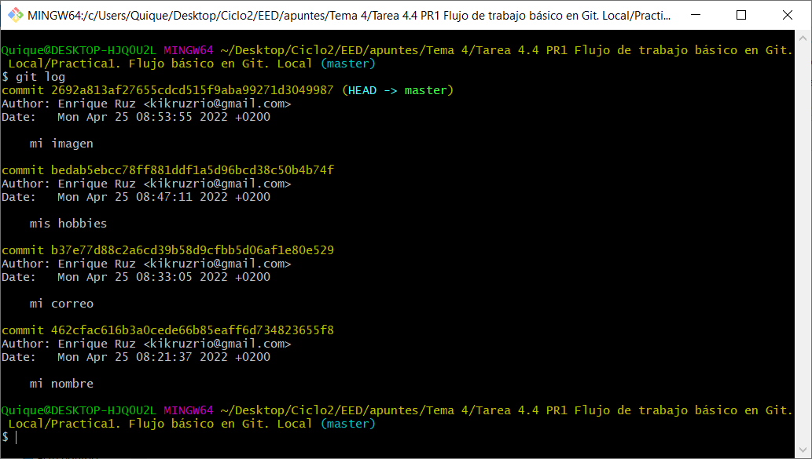

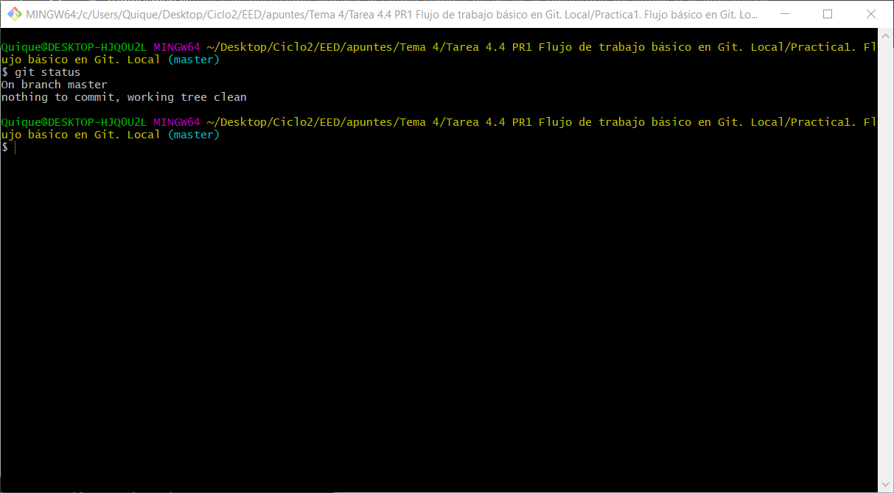

2. Acepta esta tarea de GitHub. Crearás un repositorio remoto VACÍO. No tiene ni README.md. 

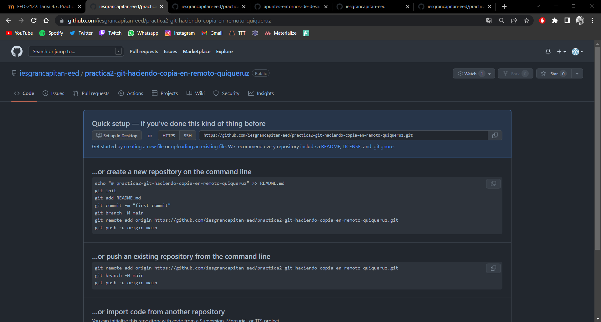

3. Fíjate en las sugerencias de GitHub. Como partes de un repositorio local ya creado, sigue las siguientes instrucciones que te sugiere GitHub... PERO RECUERDA que tu rama NO TIENE POR QUÉ ser la indicada.(nuestra rama es master)

…or push an existing repository from the command line
- git remote add origin https://github.com/iesgrancapitan-eed/practica2-git-haciendo-copia-en-remoto-lmagarin.git

- git branch -M main
  
- git push -u origin main

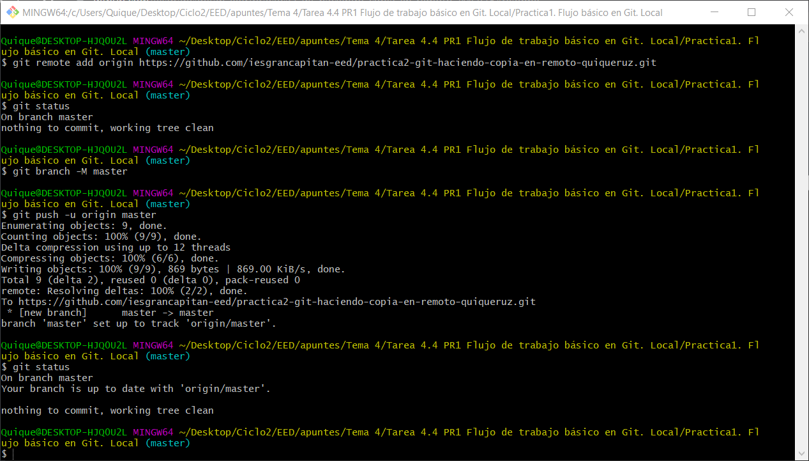

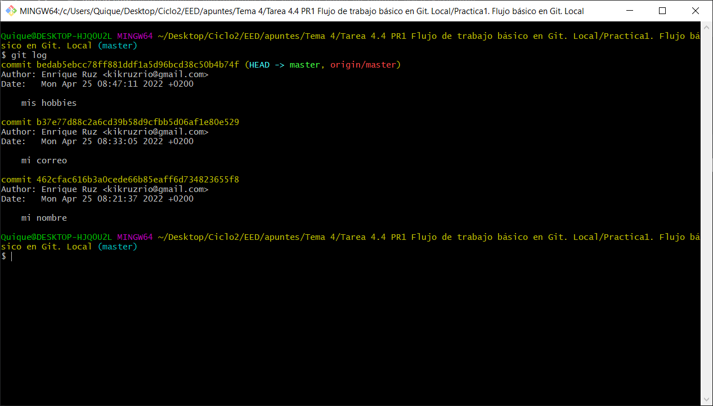

Observamos que nos sale una nueva rama origin/master

4. En local (no debes trabajar en el remoto) y siempre desde git Bash añade el fichero README.md con estas instrucciones y sus pantallazos.

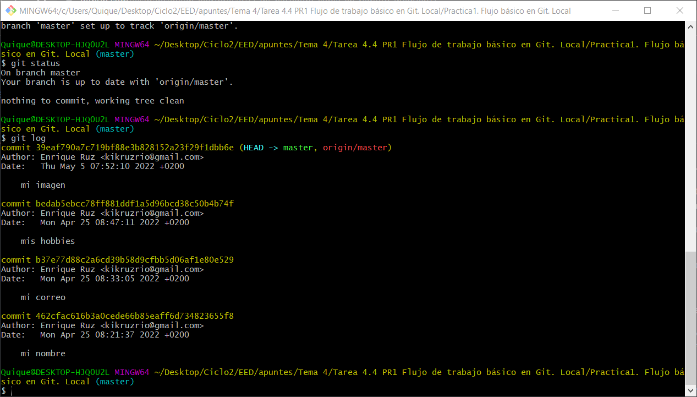

Observamos que debemos añadir los ficheros porque están untracked (no rastreados).
Para añadirlos haremos un git add y el nombre de los ficheros o carpetas.

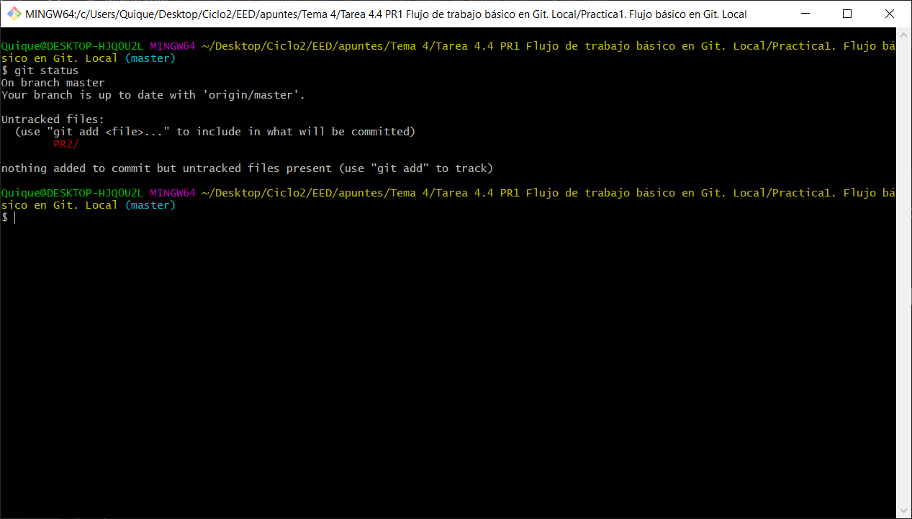

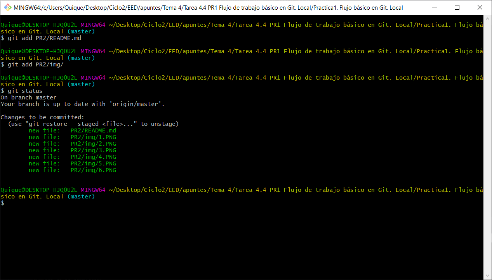
   
5. Sincroniza tus cambios con el repositorio remoto (git push)

Hacemos un git commit con el nombre del mensaje "subida en remoto".

Para que este commit local sea visible deberemos de hacer un push al remoto.

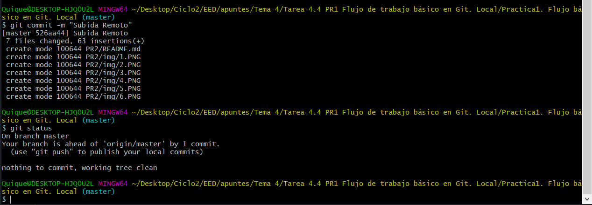

Comprobamos que el working tree está limpio.

Y hacemos un git push -u origin master.

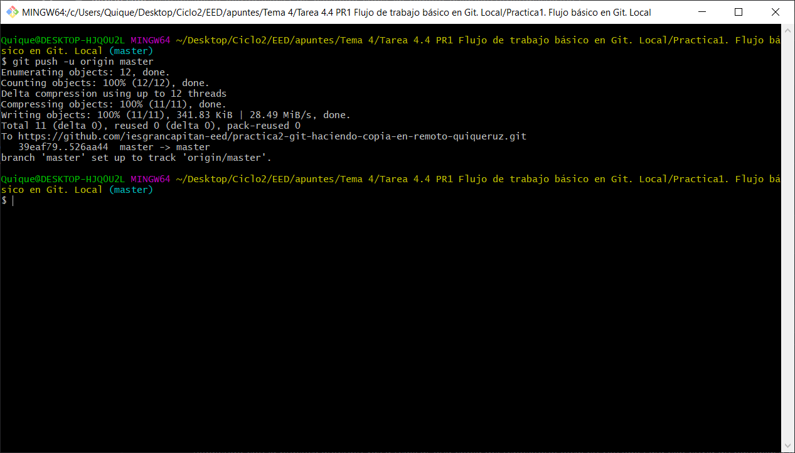

Finalmente podemos ver el log con el commit o verlo desde el navegador web que está sincronizado nuestro repositorio local con el remoto.

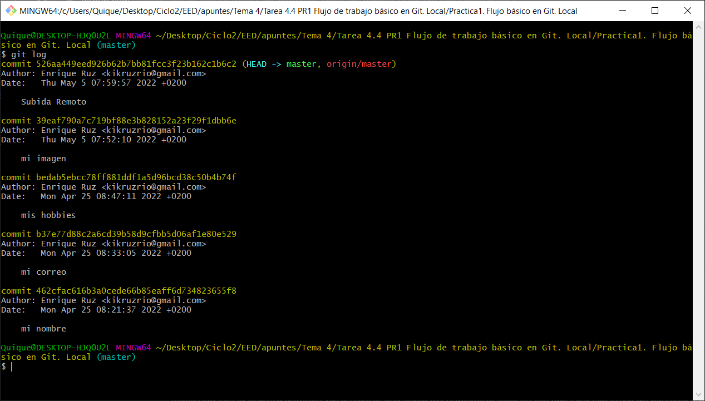